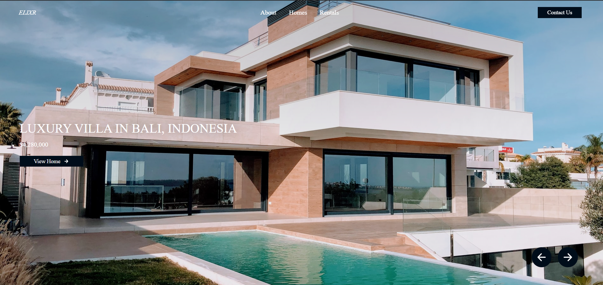
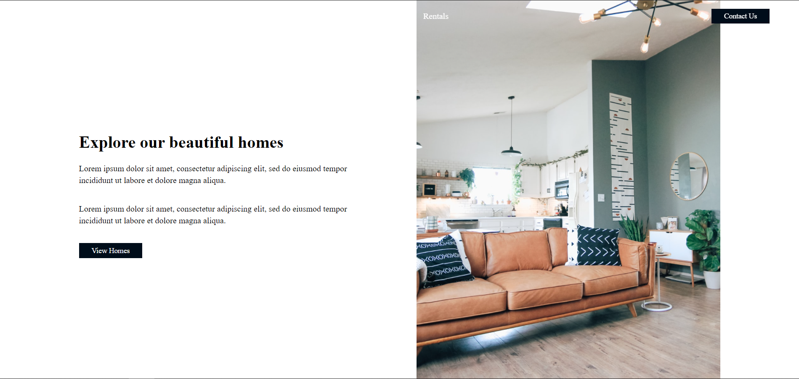

# 🏥 Real-Estate






## Features

* Search homes <br>
* Rentals <br>
* About Section <br>
* View Homes <br>

## 👇 Download Files
* Go to the GitHub repository: https://github.com/dudenayak/Real-Estate
* Download Zip or clone repo

* Then open the folder in your IDE 

## ✌️ Install the App

```shell
# to install node modules, type 
npm i styled-components react-router-dom react-icons
```

## 😻 Run Real-Estate

```bash
# to start CareForYou, type
npm start
# or if you prefer yarn
yarn start
```
Runs the app in the development mode.
Open [http://localhost:3000](http://localhost:3000) to view it in the browser.

The page will reload if you make edits.

Restart your app *(ctrl+c),* then `npm start and you're done - test it 🖖 🎉

---

